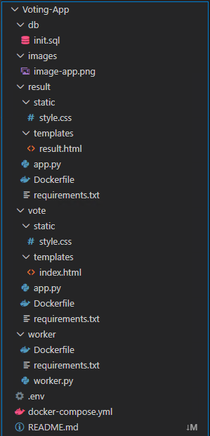
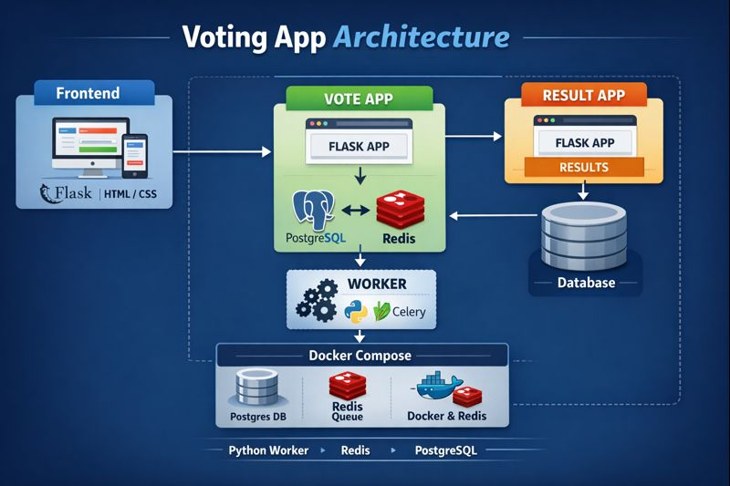
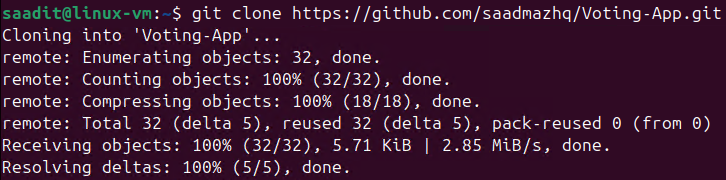
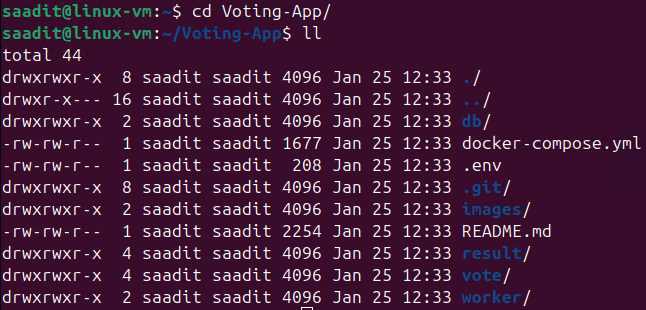
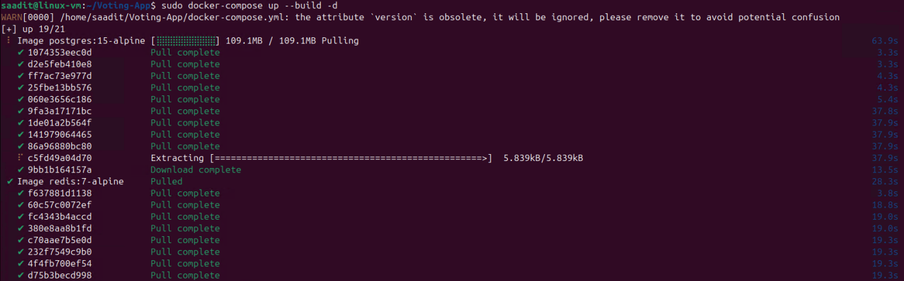
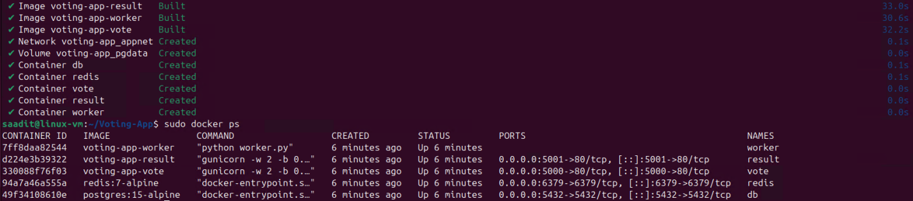
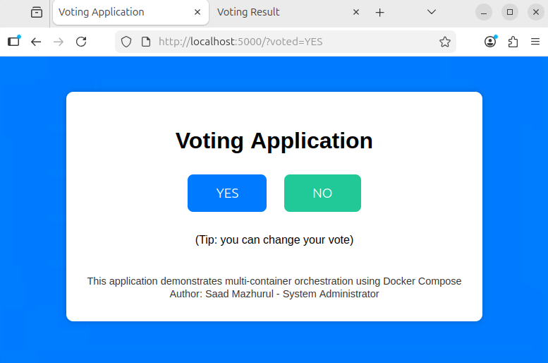
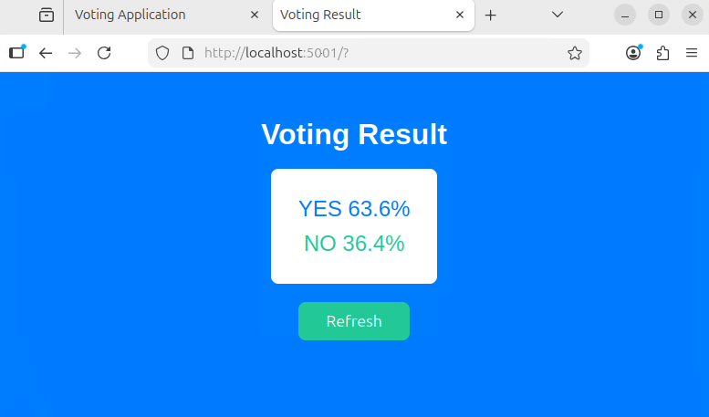

# 🗳️ Voting-App (YES / NO)

A simple **YES / NO voting application** powered by **Docker Compose**.  
This project demonstrates **multi-container orchestration** with frontend, backend, queue, database, and worker services.

---

## 🚀 Features

### 🖥️ Voting UI (Flask)
- Title: **YES vs NO!**
- Two buttons: **YES** and **NO**
- Footer: *Write Footer Message*
- Tip shown to users: *You can change your vote*

### 📊 Result UI (Flask)
- Headline: **Voting Result**
- Displays real-time **YES / NO percentages**
- Refresh button to reload results

### ⚙️ Worker Service
- Consumes votes from **Redis**
- Updates totals in **PostgreSQL** in real time

### 🗄️ Database (PostgreSQL)
- Stores votes
- Maintains aggregated results

### ⚡ Cache / Queue (Redis)
- Temporarily stores votes before processing

---

## 🏗️ Architecture & Project Structure



### Architecture Diagram



## 🔄 Application Workflow

1. User casts a **YES** or **NO** vote from the Voting UI  
2. Vote is pushed into the **Redis queue**  
3. **Worker service** consumes the vote  
4. Vote is stored and aggregated in **PostgreSQL**  
5. **Result UI** displays updated voting percentages  

---

## 🧰 Tech Stack

| Layer | Technology |
|------|-----------|
| Frontend | Flask, HTML, CSS |
| Backend | Python Worker |
| Queue | Redis |
| Database | PostgreSQL |
| Orchestration | Docker Compose |
| Architecture | Multi-container Microservices |

---

## ⚙️ Setup & Run

### 1️⃣ Clone the repository
```bash
git clone https://github.com/saadmazhq/Voting-App.git
cd Voting-App
```



### 2️⃣ Build and start containers
```bash
docker-compose up --build -d
```



### 3️⃣ Access the applications
- **Voting UI:** http://localhost:5000  
- **Result UI:** http://localhost:5001  

---

## 📸 Project Output




---

## 👤 Author

**Saad Mazhurul**  
System Administrator | DevOps Enthusiast
